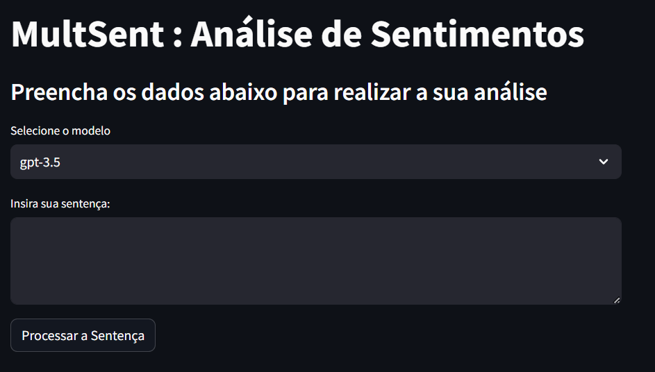

# MultSent

Projeto criado para a disciplina de Projeto Final Integrador 2 na Universidade de Fortaleza
## Links
🔗 Deploy do projeto [deploy] (https://app-example-etz8igywkc8j9tnmhegmyc.streamlit.app/)

🔗 Relatório do projeto: [relatório] (https://docs.google.com/document/d/1TXxaGYOVHVc0wmW9zdWqLr81KgP_UMzzM1nVfXnr6ac/edit)

🔗 Link to original project on github [Link do github] (https://github.com/paladinbot/streamlit-example)

## Subir o MultSent
streamlit run streamlit_app.py

## Primeiros Passos
Primeiro, rode o server de desenvolvimento:

streamlit run streamlit_app.py

You can start editing the page by modifying app/page.tsx. The page auto-updates as you edit the file.

This project uses next/font to automatically optimize and load Inter, a custom Google Font.

## Saiba mais sobre o projeto
Dê um fork no projeto, recomendações de atualizações, e tirem dúvidas aqui pelo github.

## Deploy on Streamlit
A melhor maneira de colocar em produção é utilizando o serviço da [streamlit Platform] (https://share.streamlit.io/signup).
